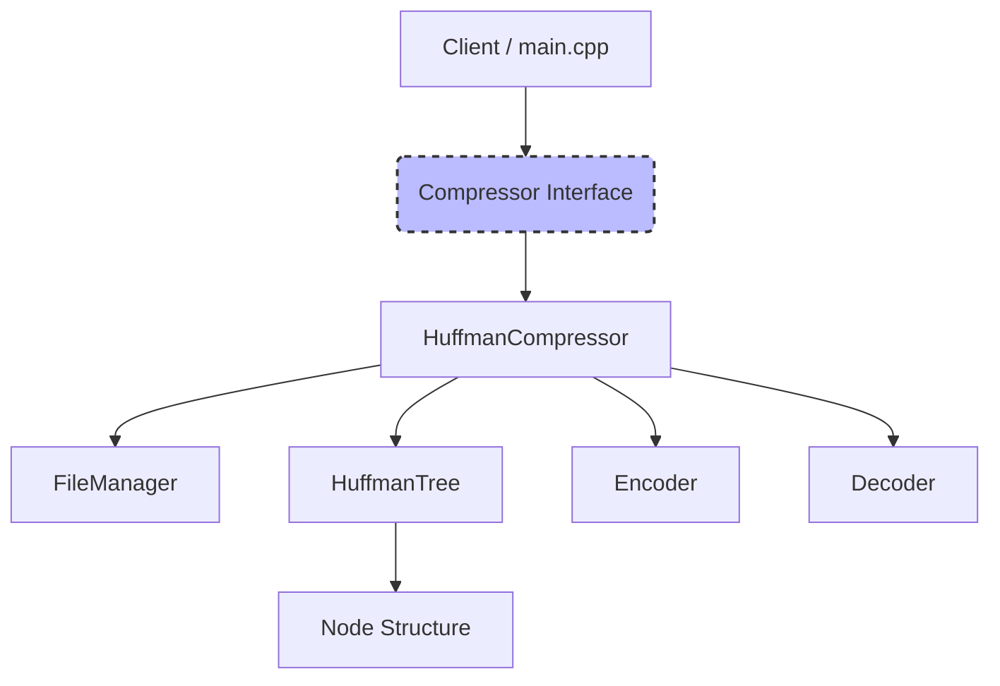

# Lossless Text Compression Engine (C++)

Lossless Text Compression Engine built with **C++** and **Huffman Coding**. Supports efficient text file compression/decompression, binary bit-packing, compression statistics, data integrity validation, and a responsive web interface for real-time compression analysis.

---

##  Directory Structure

```text
LTCompdemo
│
├── include/                       # Header files
│   ├── Compressor.h               # Abstract compressor interface
│   ├── Decoder.h                  # Huffman decoding logic
│   ├── Encoder.h                  # Huffman encoding logic
│   ├── FileManager.h              # File I/O operations
│   ├── HuffmanTree.h              # Huffman tree implementation
│   └── Node.h                     # Tree node definition
│
├── src/                           # Source files
│   ├── main.cpp                   # Application entry point
│   ├── HuffmanCompressor.cpp      # Compression controller
│   ├── HuffmanTree.cpp            # Huffman tree construction
│   ├── Encoder.cpp                # Encoding implementation
│   ├── Decoder.cpp                # Decoding implementation
│   └── FileManager.cpp            # File handling implementation
│
├── public/                        # Frontend web interface
│   ├── index.html                 # Main UI page
│   ├── style.css                  # Styling
│   └── app.js                     # Client-side logic
│
├── input/                         # Sample input files
│   └── sample.txt
│
├── output/                        # Generated output files
│   ├── compressed.huff            # Compressed output
│   └── decompressed.txt           # Restored text
│
├── tests/                         # Unit tests
│   └── test_huffman.cpp
│
├── temp/                          # Temporary runtime files
│
├── server.js                      # Node.js backend server
├── CMakeLists.txt                 # C++ build configuration
├── package.json                   # Node.js dependencies
├── .gitignore                     # Ignored files
└── README.md                      # Project documentation
```
---

## Architecture Diagram

The system uses a clean modular architecture. The abstract interface `Compressor` defines the contract, allowing easy extensions for future formats (such as PDF, binary, or image compressors) without altering the main orchestration flow.



---

## Features

- **Huffman Coding Algorithm**: Dynamic tree generation based on character frequencies.
- **O(N log N) Min-Heap Construction**: Uses `std::priority_queue` with deterministic tie-breaking for stable reconstruction.
- **Bit-level Stream Packing**: Packed bitstream writing/reading via specialized `BitWriter` and `BitReader` buffering.
- **Unicode UTF-8 Support**: Byte-oriented compression model natively supports multi-byte Unicode/UTF-8 symbols and emojis.
- **Descriptive Statistics**: Detailed reports on original size, compressed size, compression ratio, space reduction, and runtimes.
- **Robust Exception Framework**: Detailed validation of headers, empty inputs, corrupted data streams, and missing files.
- **Extensive Unit Testing**: Test suite containing 21 test cases verifying edge cases and integrity.

---

## Installation & Build Instructions

### Prerequisites
- Clang C++ Compiler (supporting C++17) or GCC.
- `make` (optional)

### Direct Compilation (Recommended)
Since CMake may not be present on all systems, we provide simple clang++ compilation instructions for maximum portability:

**Compile the Main CLI Application:**
```bash
clang++ -std=c++17 -Iinclude src/HuffmanTree.cpp src/Encoder.cpp src/Decoder.cpp src/FileManager.cpp src/HuffmanCompressor.cpp src/main.cpp -o huffman_app
```

**Compile the Unit Test Runner:**
```bash
clang++ -std=c++17 -Iinclude src/HuffmanTree.cpp src/Encoder.cpp src/Decoder.cpp src/FileManager.cpp src/HuffmanCompressor.cpp tests/test_huffman.cpp -o huffman_tests
```

---

## Usage Examples

### 1. Run Unit Tests
Verify the code correctness by running the 21-test suite:
```bash
./huffman_tests
```

### 2. Compress a File
```bash
./huffman_app -c input/sample.txt output/compressed.huff
```
**Output Example:**
```text
[INFO] Compressing: input/sample.txt to output/compressed.huff ...

========================================
          COMPRESSION SUCCESS
========================================
Original Size:     1880 bytes
Compressed Size:   1583 bytes
Compression Ratio: 1.19x
Reduction:         15.80%
Execution Time:    2.25 ms
========================================
```
*(Note: Compression ratios on small files are lower due to the header serialization overhead containing the frequency map. For larger files, the ratio approaches ~1.8x/50% reduction.)*

### 3. Decompress a File
```bash
./huffman_app -d output/compressed.huff output/decompressed.txt
```
**Output Example:**
```text
[INFO] Decompressing: output/compressed.huff to output/decompressed.txt ...

========================================
         DECOMPRESSION SUCCESS
========================================
Compressed Size:   1583 bytes
Decompressed Size: 1880 bytes
Execution Time:    1.03 ms
========================================
```

### 4. Verify Integrity
```bash
diff input/sample.txt output/decompressed.txt
```
If the command finishes silently with exit code `0`, it confirms 100% lossless compression/decompression.

---

## Custom Binary File Layout

The compressed `.huff` file utilizes a structured binary header for data integrity and decoder configuration:

| Field | Type | Size | Description |
| :--- | :--- | :--- | :--- |
| **Magic Bytes** | `char[4]` | 4 bytes | Hardcoded to `"HUFF"` to identify valid file format. |
| **Original Size** | `uint64_t` | 8 bytes | Total characters in original text. Controls decoding stop-point. |
| **Table Size** | `uint16_t` | 2 bytes | Number of unique character symbols ($S$). |
| **Table Entries** | `Array` | $S \times 9$ bytes | Array of `{char symbol, uint64_t frequency}` mapping entries. |
| **Bitstream** | `Byte Stream` | Variable | Huffman prefix-encoded bit stream, padded to the nearest byte boundary. |

---

## Complexity Analysis

### Time Complexity
1. **Character Frequency Calculation**: $\mathcal{O}(N)$ where $N$ is the number of characters in the input file.
2. **Huffman Tree Construction**: $\mathcal{O}(S \log S)$ where $S$ is the number of unique character symbols (maximum 256). The Priority Queue initialization takes $\mathcal{O}(S \log S)$ and the node merging runs $S-1$ times, popping two nodes and pushing one, which takes $\mathcal{O}(S \log S)$ time.
3. **Prefix Code Generation (DFS Traversal)**: $\mathcal{O}(S)$ as we visit each node in the Huffman Tree exactly once.
4. **Encoding (Bit Stream Generation)**: $\mathcal{O}(N)$ to read characters and write corresponding code bits. Lookups are $\mathcal{O}(1)$ via hash map.
5. **Decoding (Decompression)**: $\mathcal{O}(N)$ as we decode $N$ symbols. For each symbol, the average traversal depth is bounded by the Shannon Entropy.

### Space Complexity
- **Tree Storage**: $\mathcal{O}(S)$ memory space to store the constructed nodes.
- **Lookup Map**: $\mathcal{O}(S)$ memory space for prefix codes.
- **Overall Space**: $\mathcal{O}(S)$ which is exceptionally lightweight (at most $256 \times \text{Node Size}$).

---

## Test Results

The test suite contains 21 unit tests validating the entire pipeline.
- **Total Executed**: 21
- **Passed**: 21
- **Failed**: 0

**Key Test Cases Covered:**
- Empty strings and empty files.
- Single-character files (branches tree using a dummy right node).
- Repeated character files (e.g. `"aaaa"`).
- Mixed whitespace, alphanumeric characters, and special symbols.
- All printable ASCII table symbols.
- Unicode UTF-8 symbols and emoji sets (e.g. `Hello 世界 🌍!`).
- Corrupted compressed headers (validates magic bytes, flags).
- Large text file (15 KB blocks of repetitive and structural contents).

---

## SOLID Principles & Clean Architecture

- **S (Single Responsibility)**: Each class is dedicated to one job: `Node` models data, `HuffmanTree` governs tree logic, `Encoder`/`Decoder` process streams, `FileManager` handles file IO/headers, and `HuffmanCompressor` acts as the orchestrator.
- **O (Open/Closed)**: The system is open for extension but closed for modification. New compression schemes (e.g., PDF or image compression) can implement the abstract `Compressor` interface without modifying client code.
- **L (Liskov Substitution)**: `HuffmanCompressor` fully behaves as a `Compressor` and can substitute it transparently.
- **I (Interface Segregation)**: `Compressor` interface defines only the necessary `compress` and `decompress` mechanisms, avoiding bloated interfaces.
- **D (Dependency Inversion)**: High-level CLI modules depend on the abstraction `Compressor`, rather than the concrete implementation.

---

## Web Interface & REST API Wrapper

A responsive developer dashboard is provided under the `public/` directory, hosted by a Node.js REST API server (`server.js`).

### REST API Endpoints

#### 1. Compress Payload
- **Endpoint**: `POST /api/compress`
- **Headers**: `Content-Type: application/json`
- **Body**: `{"text": "your text here"}` OR standard multipart/form-data with a file upload (field key `file`).
- **Response**:
  ```json
  {
    "originalSize": 1880,
    "compressedSize": 1583,
    "ratio": 1.19,
    "reduction": 15.80,
    "timeMs": 2.25,
    "codes": { "97": "01", "98": "10" },
    "bitString": "011001...",
    "treeJSON": { "frequency": 30, "left": { ... }, "right": { ... } },
    "originalText": "...",
    "compressedBase64": "SFVGRg..."
  }
  ```

#### 2. Decompress Payload
- **Endpoint**: `POST /api/decompress`
- **Headers**: `Content-Type: application/json`
- **Body**: `{"compressedBase64": "SFVGRg..."}` OR standard multipart/form-data file upload (field key `file`).
- **Response**:
  ```json
  {
    "compressedSize": 1583,
    "decompressedSize": 1880,
    "timeMs": 1.03,
    "decompressedText": "..."
  }
  ```

---

## Web Interface Deployment Instructions

### 1. Local Run
Install Node dependencies and start the local development server:
```bash
npm install
npm start
```
Open `http://localhost:3000` in your web browser.

### 2. Frontend Deployment (GitHub Pages)
1. Push the contents of the `public/` folder to a GitHub repository.
2. In [app.js](file:///Users/rupamhaldar/Desktop/LTC-Code/public/app.js), configure `API_URL` to point to your deployed production backend:
   ```javascript
   const API_URL = 'https://huffman-engine-backend.onrender.com';
   ```
3. Enable **GitHub Pages** in the repository settings to serve the static frontend.

### 3. Backend REST API Deployment (Render / Heroku / Railway)
To deploy the C++ wrapper API:
1. Configure a Node.js project environment on Render.
2. Set the **Build Command** to build both the C++ native binary and Node modules:
   ```bash
   clang++ -std=c++17 -Iinclude src/HuffmanTree.cpp src/Encoder.cpp src/Decoder.cpp src/FileManager.cpp src/HuffmanCompressor.cpp src/main.cpp -o huffman_app && npm install
   ```
3. Set the **Start Command** to launch the server:
   ```bash
   npm start
   ```

---

## Future Enhancements
- **Binary/PDF/Image support**: Implement `PdfCompressor` or `BinaryCompressor` classes inheriting from `Compressor` with specialized serializers.
- **Canonical Huffman Trees**: Reduce header overhead by storing only code lengths instead of the entire frequency table.
- **Block-based Compression**: Process extremely large files in fixed chunks to optimize memory footprints.

