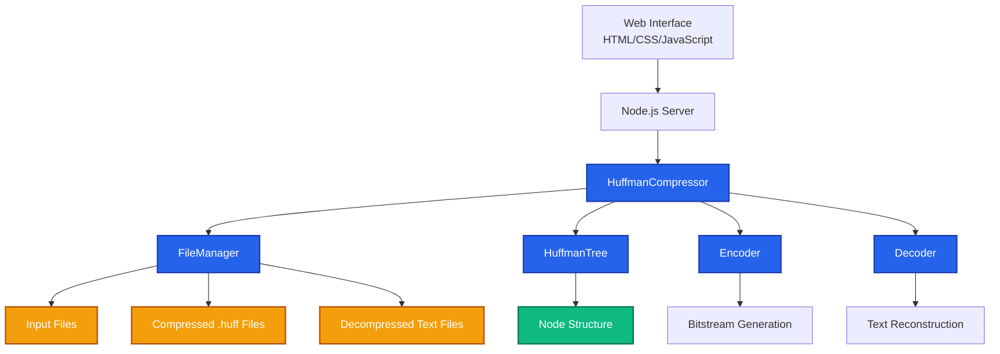
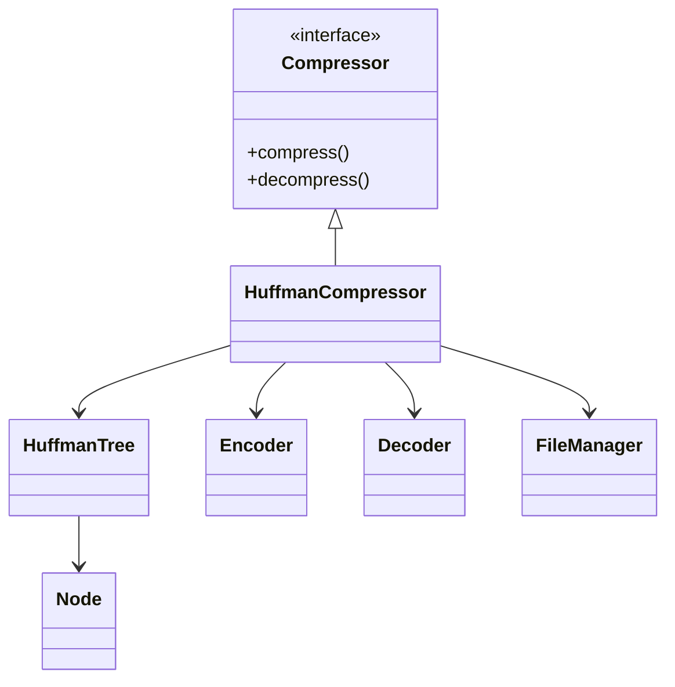

# Lossless Text Compression Engine using (C++)
Lossless Text Compression Engine built with C++ and Huffman Coding. Supports efficient text file compression/decompression, binary bit-packing, compression statistics, data integrity validation, and a responsive web interface for real-time compression analysis.

---

## Project Architecture Diagram
The system uses a clean modular architecture. The abstract interface `Compressor` defines the contract, allowing easy extensions for future formats (such as PDF, binary, or image compressors) without altering the main orchestration flow.

##  System Architecture

### Compression Workflow

### Decompression Workflow

### Class Relationships

